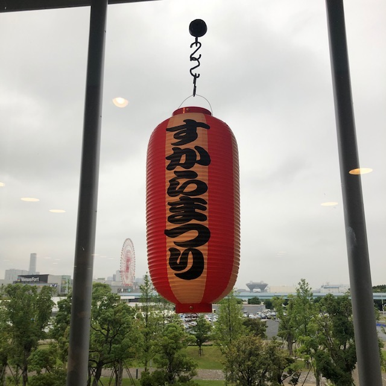
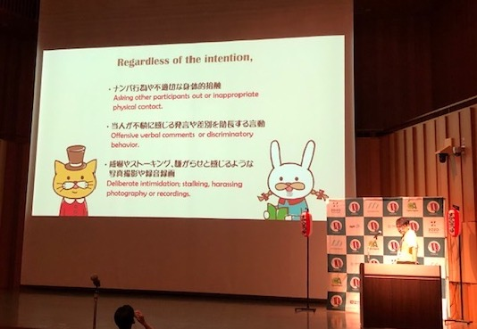
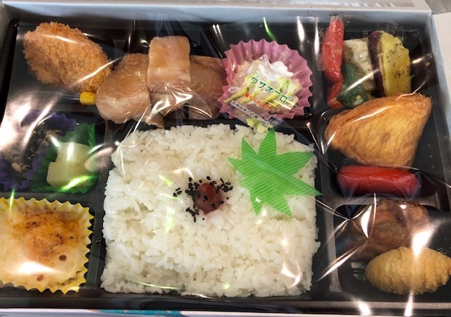
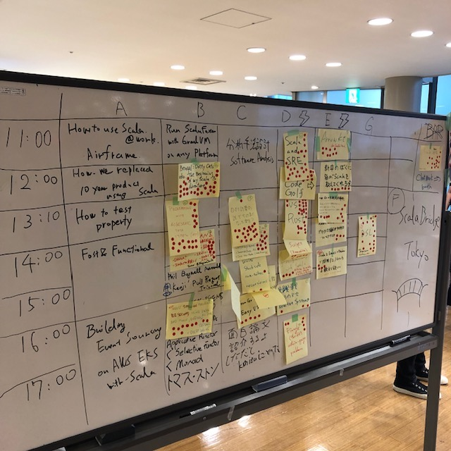
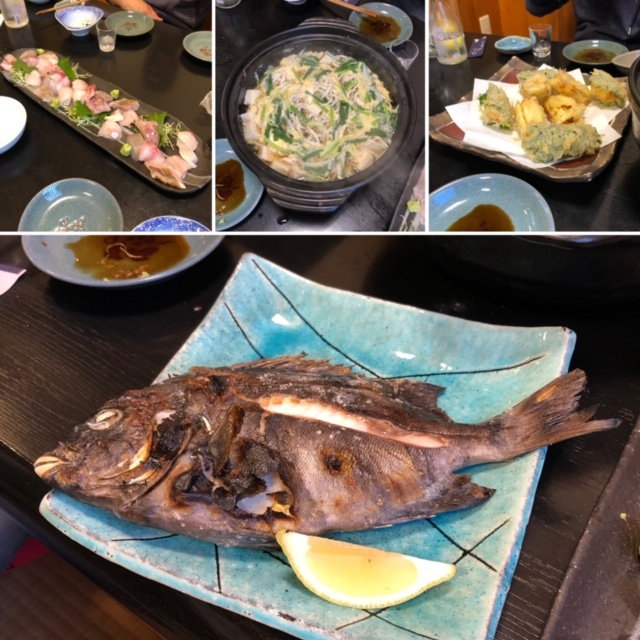

Scala Matsuri
-------------

> The largest international Scala conference in Asia

That seems about right. It's a three-day event hosted in Tokyo:

1. Workshops, hackathon, training, etc. I didn't go to this day because it
   was Japanese only.

2. Programmed conference talks, in two rooms with live interpretation.

3. Unconference day, in two rooms with live interpretation and a few smaller
   rooms without.

Unusually (in my experience, at least) Scala Matsuri is a bilingual conference:
talks are presented in Japanese or English with subtitles added to slides and
live interpretation for presentations.

This seemed to work really well for the Japanese talks I saw.

Talks
-----

### Scala 3, what does it means for me?

https://www.slideshare.net/scalaconfjp/scala-3-what-does-it-means-for-me-scala-3-by-joan-goyeau

Joan Goyeau from Netflix described some of the ways Dotty will improve the
day to day experience of programming in Scala.

1. Enumerations (instead of terrible things)
2. Union types (instead of `Either[Exception, ?]` and `Refined` instead of `IllegalArgumentException`)
3. Changes to `null`. Using `Foo | Null` when you want a nullable type.
5. Tuple deconstruction: `(first, second) => s"$first $second"`
6. `opaque type` instead of `extends AnyVal`
7. Changes to extension methods (instead of implicit classes)
8. Type classes (instead of implicit values)
9. `language:strictEquality`
10. `trait Foo[F[_]: Frobnificateable] { }`
11. Cross compilation (will support 2.13 / 3.0 by packing TASTy IR into products)

### Using Akka Cluster for a payment service

https://speakerdeck.com/negokaz/using-akka-cluster-for-a-payment-service

Kazuki Negoro from TIS described a project to implement a payment service
using Akka. The story of moving (part of) a system from CRUD to ES+CQRS.

Lots of high availability, high throughput, Akka, Cassandra, etc.

### Data processing @Spotify using Scio

Julien Tournay from Spotify described Scio - a Scala data processing framework.

Spotify datascience scalability: lots of data sets, which are large, analysed
by many people with wide range of background.

Scio is a Spotify library based on Apache Beam. Focus on documentation,
predicability, performance, and productivity.

Recent work has improved

- Data encoding safety and performance: moving from Kryo to Typesafe to get
static codecs and get much better performance: an anonymisation job is more
than 2.5 times faster.

- Join efficiency: using sort merge bucket join to have a single shuffle which
is amortised over all subsequent joins. Also improves compression efficiency.

- BeamSQL based on SchemaCoder. Use a `StringContext` for literal SQL queries
in Scala source code. Can check fields, types, etc. based on the types of the
data codecs.

Looks like it might be an interesting tool to have in the toolbox for data
engineering and data science engagements.

### Benefits of passing the values around using Eff type

Compares a bunch of effect types to `Eff`: `Future[_]`, `Future[Try[_]]`,
`Future[Either[E, _]`, `EitherT[Future, E, _]`, ...

Like `Eff[E,A]` because:

- Simple syntax with low noise (lifting, mapping errors, etc)
- Multiple effects
- Better performance
- Better semantics (order of evaluation, etc.)

### Scala vs Kotlin

Yuichi Maekawa from Alp (not the ALP) is a Kotlin developer who's recently
been working in Scala. Discussed some of the similarities and differences
between Scala and Kotlin.

Talked about the philosophy/focus of the different languages, some of the
syntax similarities and differences, and some of the differences between APIs
of FP libraries.

### Gentle Introduction to DOT calculus

Kota Mizushima (DWANGO Co., Ltd.) is a "parsing algorithm enthusiast" and gave
a *Gentle Introduction to DOT calculus* in Japanese. I guess that the name was
a subtle hint about the content.

Began with a short intro to the history of the DOT calculus.

Then a short intro to:

1. abstract syntax
2. typing rules
3. operational semantics

*Then* started on the DOT calculus. Needless to say, he ran out of time and
continued with this the next day. Alas, the second session was in an
untranslated room so I didn't see it. :-(

### Making Logic Monad

Sanshiro Yoshida (Recruit Marketing Partners) talked about implementing logic
programming monads in Scala.

Gave a short introduction to logic programming (using the Prolog hello world:
list concatenation)

Interesting introduction to get to grips with the topic. But if you have serious
applications this probably won't cut the mustard (IIRC Oleg has a better
formulation with more correct correctness, and see Ed Kmett's recent work)

### Scala Loves Graal

Flavio W. Brasil from Twitter (he's on the VM team) talked about Graal and
Scala. Graal, not GraalVM.

Just turning Graal on improves performance on almost all benchmarks to such an
extent that almost all usecases will see real world improvements.

- Scala is not Java. Optimising compilers which are designed for Java programs
  are unlikely to (and, indeed, do not) handle Scala programs as well as they
  could.

  Graal is young and Java, C2 is 20 years old and C++. Improving Graal is a
  *lot* easier.

- Composable APIs (which are very common in Scala code) are interpretable, not
  specialisable. Many monads are implemented with an AST and an intepretter.

They've improved Graal with better support for `Future` (seeing through unsafe
methods to improve CPU 5% and allocations 16%) and itable stubs (invoking
interface methods indirects through a second layer of tables -- one per
implemented interface -- improved this by observing many implementations will
have same layout, allow to just jump to the impl).

This was interesting.

### CPS or DI

https://gakuzzzz.github.io/slides/cps_or_di/

Talked about using continuation passing style or dependency injection.

Scale of modularity and reuse, and the degree of coordination required between
components being reused was the message.

- Large components, or many components with a high degree of coordination
  required to reuse them together safely: DI.

- Small components with lots of ad hoc reuse: CPS.

I thought that if you're viewing CPS as addressing the same problem as DI then
you might have missed the point (I think some of the questions maybe got the
same impression). Was an interesting talk, though.

### Run Programs Faster Anywhere using GraalVM

Amitpal Singh (Oracle) talked about GraalVM, including quite a bit of Scala
specific content.

Interesting discussion of the native compilation stuff in GraalVM.

Covered some of the multi-lingual stuff too. Didn't address the main question
I have about the idea of running R, NodeJS, etc. code on GraalVM: no-one uses
R because it's a good language, they use it because of all the libraries
implemented in high-performace C++ and Fortran. That's the story that really
needs selling for most of these multi-lingual things.

### Dotty Cats

Walter Chang (Scala Taiwan) presented his library Bengal - a functional
programming library in Dotty.

It's an incomplete, non-clone of Cats/Scalaz to demonstrate functional
programming in that same style in Scala3.

Might be a good code base to look at to get a better understanding of the way
Scala 3 will change the Haskell-ish typed, typeclass-oriented approach to
functional programming.

### Programming with ADTs

Most of us have probable seen a talk like this: introducing the "algebraic"
part of algebraic data types.

Sums, Products, recursion, oh my!

### Selective applicative functors

I hacked up some Scala code illustrating the Selective Applicative Functor
abstraction I discussed a while back and gave a short lightening talk about
that.

## Afterwards

Afterwards I took a Shinkansen to Niigata city, a ferry to Ryotsu
(on Sadogashima), and a bus to Manoshimmachi, and spent a week experiencing
[some of] the process of making sake in a brewery. We students visited all of
the other breweries on the island too.

I ate a buttload of sashimi nigirizushi that I would never order myself --
fugu, ebi, uni -- a fish with a face still on it. And I didn't die or throw up.

I also went to a bunch of galleries and museums, snapped the arms off my glasses,
and sprained my knee.

All in all, a good trip. (Though I did have to buy another suitcase to fit all
the bottles of sake I brought back with me.)
